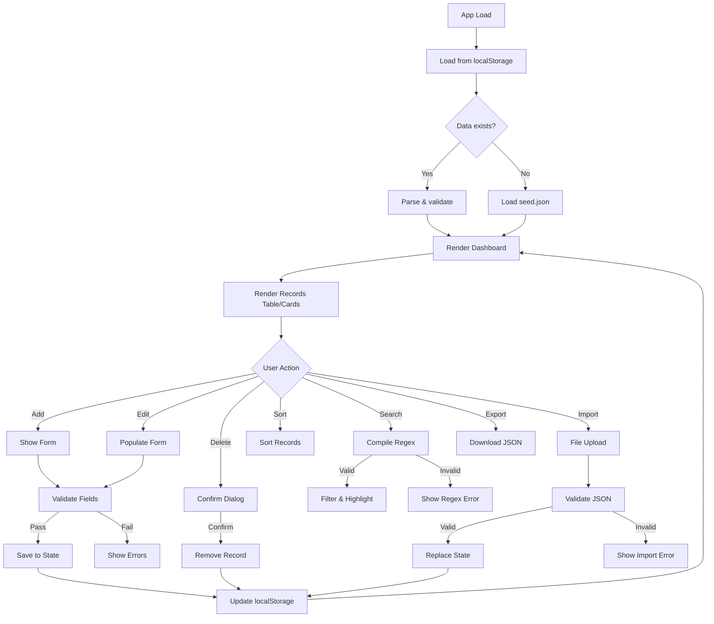
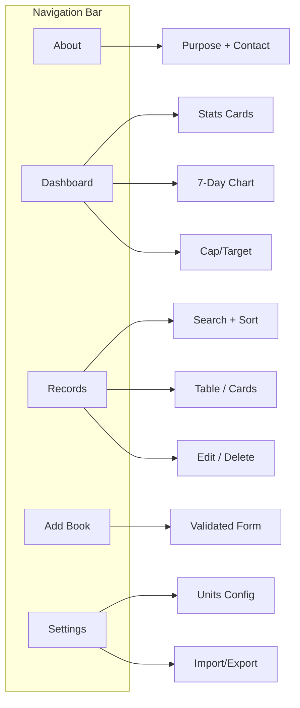

# Book & Notes Vault — Wireframes

## Layout Overview

The app uses a **mobile-first**, single-page layout with 3 responsive breakpoints.

---

## Mobile Layout (≤ 360px)

```
┌──────────────────────────────┐
│  ☰   Book & Notes Vault     │  ← Header + hamburger
├──────────────────────────────┤
│  [About] [Dashboard]        │  ← Collapsible nav
│  [Records] [Add] [Settings] │     (hidden by default)
├──────────────────────────────┤
│  ╔════════╗  ╔════════╗     │
│  ║ Total  ║  ║ Total  ║     │  ← Dashboard stats
│  ║ Books  ║  ║ Pages  ║     │     (2×2 grid)
│  ║  12    ║  ║ 4,532  ║     │
│  ╚════════╝  ╚════════╝     │
│  ╔════════╗  ╔════════╗     │
│  ║ Top    ║  ║ Target ║     │
│  ║ Tag    ║  ║ 15/50  ║     │
│  ║Fiction ║  ║ ██░░░  ║     │
│  ╚════════╝  ╚════════╝     │
├──────────────────────────────┤
│  ╔══════════════════════╗    │
│  ║  7-Day Trend  ▁▃▅▇▅ ║    │  ← Mini bar chart
│  ╚══════════════════════╝    │
├──────────────────────────────┤
│  🔍 [Search regex...    ] 🔤 │  ← Search + case toggle
├──────────────────────────────┤
│  Sort: [Date ▼] [Title] [Pg]│  ← Sort buttons
├──────────────────────────────┤
│  ┌─────────────────────────┐ │
│  │ 📖 Intro to Algorithms  │ │  ← Record CARD
│  │ Author: T.H. Cormen     │ │
│  │ Pages: 1312  Tag: CS    │ │
│  │ Added: 2025-09-15       │ │
│  │ [✏ Edit]  [🗑 Delete]   │ │
│  └─────────────────────────┘ │
│  ┌─────────────────────────┐ │
│  │ 📖 To Kill a Mockingbird│ │  ← Another card
│  │ Author: Harper Lee      │ │
│  │ ...                     │ │
│  └─────────────────────────┘ │
├──────────────────────────────┤
│           [ ＋ Add Book ]    │  ← Floating/sticky button
├──────────────────────────────┤
│  © 2025 | GitHub | Email    │  ← Footer
└──────────────────────────────┘
```

---

## Tablet Layout (768px)

```
┌────────────────────────────────────────────────────────┐
│  📚 Book & Notes Vault   About  Dashboard  Records  Add  Settings  │
├────────────────────────────────────────────────────────┤
│  ╔═══════╗ ╔═══════╗ ╔═══════╗ ╔═══════╗ ╔═══════════╗│
│  ║Total  ║ ║Total  ║ ║ Top   ║ ║Target ║ ║ 7-Day     ║│
│  ║Books  ║ ║Pages  ║ ║ Tag   ║ ║15/50  ║ ║ ▁▃▅▇▅▃▁  ║│
│  ║  12   ║ ║ 4532  ║ ║Fiction║ ║██░░░░ ║ ║           ║│
│  ╚═══════╝ ╚═══════╝ ╚═══════╝ ╚═══════╝ ╚═══════════╝│
├────────────────────────────────────────────────────────┤
│  🔍 [Search regex pattern...        ] [Aa] case toggle │
│  Sort: [Date Added ▼] [Title A-Z] [Pages ↑]           │
├────────────────────────────────────────────────────────┤
│  ┌──────────┬──────────┬─────┬──────┬──────┬─────────┐│
│  │ Title    │ Author   │Pages│ Tag  │ Date │ Actions ││
│  ├──────────┼──────────┼─────┼──────┼──────┼─────────┤│
│  │ Intro to │ T.H.     │1312 │ CS   │09-15 │ ✏  🗑   ││
│  │ Algori...│ Cormen   │     │      │      │         ││
│  ├──────────┼──────────┼─────┼──────┼──────┼─────────┤│
│  │ To Kill  │ Harper   │ 281 │Ficti.│09-18 │ ✏  🗑   ││
│  │ a Mock...│ Lee      │     │      │      │         ││
│  └──────────┴──────────┴─────┴──────┴──────┴─────────┘│
├────────────────────────────────────────────────────────┤
│  ┌──── Add / Edit Book ────────────────────────────┐   │
│  │ Title:  [________________________]              │   │
│  │ Author: [________________________]              │   │
│  │ Pages:  [______]   Tag: [_______________]       │   │
│  │ Date:   [YYYY-MM-DD]                           │   │
│  │                          [Submit]  [Cancel]     │   │
│  └─────────────────────────────────────────────────┘   │
├────────────────────────────────────────────────────────┤
│  © 2025 Book & Notes Vault | GitHub | Email            │
└────────────────────────────────────────────────────────┘
```

---

## Desktop Layout (≥ 1024px)

```
┌──────────────────────────────────────────────────────────────────────┐
│  📚 Book & Notes Vault      About   Dashboard   Records   Add   Settings   │
├──────────────────────────────────────────────┬───────────────────────┤
│                                              │                       │
│  🔍 [Search regex...            ] [Aa]       │  DASHBOARD             │
│  Sort: [Date ▼] [Title A-Z] [Pages ↑]       │                       │
│                                              │  ╔═════════════════╗  │
│  ┌────────┬────────┬─────┬──────┬──────┬───┐ │  ║  Total Books    ║  │
│  │ Title  │ Author │Pages│ Tag  │ Date │Act│ │  ║     12          ║  │
│  ├────────┼────────┼─────┼──────┼──────┼───┤ │  ╚═════════════════╝  │
│  │Intro   │Cormen  │1312 │ CS   │09-15 │✏🗑│ │  ╔═════════════════╗  │
│  │Algos   │        │     │      │      │   │ │  ║  Total Pages    ║  │
│  ├────────┼────────┼─────┼──────┼──────┼───┤ │  ║    4,532        ║  │
│  │To Kill │Harper  │ 281 │Fict. │09-18 │✏🗑│ │  ╚═════════════════╝  │
│  │a Mock. │Lee     │     │      │      │   │ │  ╔═════════════════╗  │
│  ├────────┼────────┼─────┼──────┼──────┼───┤ │  ║  Top Tag        ║  │
│  │Brief   │Hawking │ 256 │Sci.  │09-20 │✏🗑│ │  ║   Fiction       ║  │
│  │History │        │     │      │      │   │ │  ╚═════════════════╝  │
│  ├────────┼────────┼─────┼──────┼──────┼───┤ │  ╔═════════════════╗  │
│  │1984    │Orwell  │ 328 │Fict. │09-22 │✏🗑│ │  ║  Target: 15/50  ║  │
│  ├────────┼────────┼─────┼──────┼──────┼───┤ │  ║  ████████░░░░░  ║  │
│  │Sapiens │Harari  │ 443 │Hist. │09-25 │✏🗑│ │  ╚═════════════════╝  │
│  └────────┴────────┴─────┴──────┴──────┴───┘ │                       │
│                                              │  ╔═════════════════╗  │
│  ┌──── Add / Edit Book ────────────────────┐ │  ║ 7-Day Trend     ║  │
│  │ Title:  [_____________________________] │ │  ║  ▁ ▃ ▅ ▇ ▅ ▃ ▁ ║  │
│  │ Author: [_____________________________] │ │  ║ M T W T F S S   ║  │
│  │ Pages:  [________]  Tag: [____________] │ │  ╚═════════════════╝  │
│  │ Date:   [YYYY-MM-DD]                   │ │                       │
│  │                    [Submit]  [Cancel]    │ │  [⬇ Export]  [⬆ Import]│
│  └─────────────────────────────────────────┘ │                       │
├──────────────────────────────────────────────┴───────────────────────┤
│  © 2025 Book & Notes Vault  |  GitHub  |  Email                      │
└──────────────────────────────────────────────────────────────────────┘
```

---

## Component Flow Diagram



---

## Navigation Flow



---

## Settings Page Wireframe

```
┌─────────────────────────────────────┐
│  ⚙ Settings                        │
├─────────────────────────────────────┤
│                                     │
│  Reading Speed                      │
│  Pages per hour: [  30  ]           │
│                                     │
│  Reading Target                     │
│  Books this year: [  50  ]          │
│                                     │
│  ─────────────────────────────      │
│                                     │
│  Data Management                    │
│  [⬇ Export JSON]  [⬆ Import JSON]  │
│                                     │
│  ⚠ Import will replace all data    │
│                                     │
└─────────────────────────────────────┘
```

---

## Confirmation Modal Wireframe

```
┌────────────────────────────────┐
│  ⚠ Delete Book                 │
│                                │
│  Are you sure you want to      │
│  delete "Intro to Algorithms"? │
│                                │
│  This action cannot be undone. │
│                                │
│     [Cancel]    [🗑 Delete]    │
└────────────────────────────────┘
```
